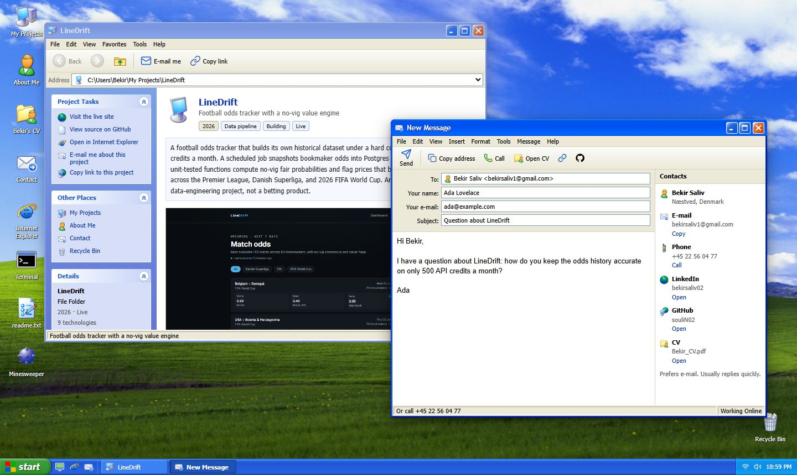
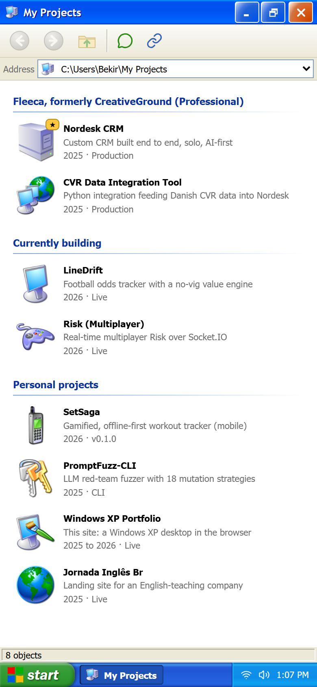

# Portfolio XP

My portfolio, built as a Windows XP desktop you can actually use. Double-click the icons to explore my projects, read my CV, run my live projects in Internet Explorer, or send me an e-mail from Outlook Express.

**Live:** [bekirsaliv.dk](https://bekirsaliv.dk) · **Plain text version:** [bekirsaliv.dk/simple](https://bekirsaliv.dk/simple)



## What's on the desktop

| Window | What it does |
| --- | --- |
| **My Projects** (Explorer) | Projects as folders, with a task pane, back/forward/up navigation, and an address bar that doubles as a project picker |
| **About Me** (System Properties) | Bio, skills, experience and education as dialog tabs |
| **Contact** (Outlook Express) | A real contact form sent through Resend, falling back to the visitor's mail app |
| **Internet Explorer** | Runs my live projects (LineDrift, Risk) inside the desktop |
| **Terminal** (Command Prompt) | `help`, `projects`, `open linedrift`, `msg hi bekir!`, `tasklist`/`taskkill`, `git log`, `calc`, tab completion and history. On phones it wraps to the screen, commands in the output can be tapped, and a quick-key bar stands in for Tab and the arrow keys |
| **Games** | XP's games folder: Solitaire (with the bouncing-cards win), Spider Solitaire (1, 2 or 4 suits), FreeCell (Microsoft's numbered deals, so game #1 is XP's game #1), Hearts against three computer players, and Minesweeper. Drag cards or tap to move them, with undo and saved statistics |
| **Bekir's CV**, **readme.txt**, **Recycle Bin** | The rest of a proper desktop |

Plus a boot screen, the XP Welcome screen, Start menu, taskbar with Quick Launch, a working volume control, balloon tips, Turn Off and Log Off dialogs, and a Mystify screensaver.

### Built for the people who visit

- **Returning visitors skip the intro.** The boot screen can be skipped with any key and only plays once per session. `prefers-reduced-motion` skips the animation.
- **Deep links** open windows directly and skip the intro, which is handy in job applications:
  - `/?open=projects&project=linedrift` opens My Projects at LineDrift
  - `/?open=about,contact` opens several windows
  - `/?open=contact` opens the contact form
- **Phones work.** Windows open full screen, taps replace double-clicks, and long-press replaces right-click.
- **Keyboard and screen readers work.** Arrow keys move between icons, Enter opens, Escape closes menus and dialogs, and a skip link leads to the plain text version.
- **Link previews and search:** Open Graph image, JSON-LD `Person` data, sitemap, and a server-rendered `/simple` page.



## Tech

Next.js 15 (App Router), React 19, TypeScript (strict), Tailwind CSS v4, Resend, Vitest, and GitHub Actions.

```
app/            routes: the desktop, /simple, the OG image, /api/contact
components/
  desktop/      shell: Desktop, XpWindow, DesktopIcons, Taskbar, StartMenu, dialogs
  screens/      boot, Welcome, "safe to turn off", screensaver
  windows/      one component per application
  games/        the card table, cards, and game window chrome shared by the card games
data/           the single source of truth for all copy: profile, projects, apps
lib/            pure logic, unit tested: window manager, terminal, calculator,
                minesweeper, solitaire, spider, freecell, hearts (with its
                computer players), deep links, contact validation, mail,
                rate limiting
```

A few decisions worth knowing about:

- **The window manager is a pure reducer** (`lib/windowManager.ts`). Stacking, focus, minimize and maximize are all state transitions, and every move, resize or browser resize is clamped so a window's title bar can never end up out of reach.
- **All copy comes from `data/`.** The windows, terminal output, readme.txt, `/simple` and the JSON-LD block are generated from the same files, so they can't drift apart.
- **The contact form really sends** (`lib/mail.ts`, Resend). Input is validated in the window for instant feedback and again on the server, a hidden honeypot field catches bots, each IP is rate limited, and the e-mail's Reply-To is the visitor, so answering is one click.
- **Heavier windows load on demand** with `next/dynamic`, and minimized windows stay mounted so nothing is lost.

## Running it

```bash
npm install
npm run dev          # http://localhost:3000
```

```bash
npm run lint
npm run typecheck
npm test
npm run build
```

CI runs all four on every push and pull request.

### Environment variables

Everything works without them: the contact form then hands the message to the visitor's own mail app instead. See [`.env.example`](.env.example).

| Variable | Used by | Notes |
| --- | --- | --- |
| `RESEND_API_KEY` | Contact form | |
| `CONTACT_TO_EMAIL` | Contact form | Defaults to the address in `data/profile.ts` |
| `CONTACT_FROM_EMAIL` | Contact form | A sender on a domain verified in Resend |

## Credits

Windows XP, its icons, wallpaper and sounds belong to Microsoft. This is a fan-made tribute for a personal portfolio and isn't affiliated with Microsoft.

The code is available under the MIT License.
